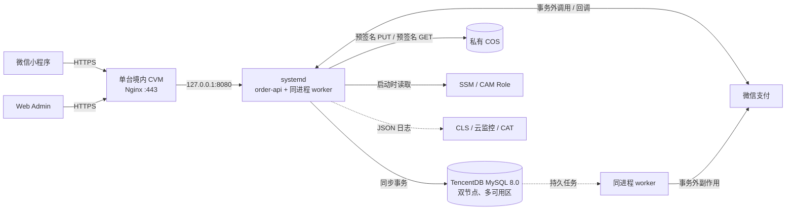

# 在线点单系统技术文档

## 1. 技术目标

系统服务于 500 人以内的政府/企业餐饮点单场景，核心要求是稳定、清晰、可维护。技术设计应优先保证下单、支付回调、订单核销、后台管理这些关键链路可靠。

## 2. 一期生产架构基线

本节是一期生产承载、交易一致性与运维边界的唯一技术基线。适用规模为 500 人以内、短时集中点单；其中容量、RPO/RTO 只是不高于目标云规格的验收目标，当前均未实测，不代表已达成结果、SLA 或云厂商保证。

### 2.1 组件与数据流

| 组件 | 固定职责 | 事实边界 |
| --- | --- | --- |
| Nginx | 在 `:443` 终止 TLS、承载 Web Admin 静态文件、反向代理；`:80` 只跳转 HTTPS | 不保存业务事实 |
| `order-api` | Go/Gin 模块化单体，处理同步 API、微信回调和健康检查 | 只通过 MySQL 事务提交业务事实 |
| 同进程 worker | 未支付超时、支付对账、inbox/outbox 消费与重试；由同一 systemd 单元管理 | 持久任务在 MySQL，不使用内存 timer 作为事实 |
| TencentDB MySQL 8.0 | 同地域双节点、多可用区、一主一备，仅内网访问 | 应用业务事实源 |
| 微信支付 | 预支付、支付与退款通知、查单与退款 | 支付/退款外部结算事实源；客户端跳转不是事实源 |
| 私有 COS | 商品图片二进制及版本 | MySQL 只保存服务端生成的 object key 和元数据 |
| SSM / CAM Role | 按环境读取密钥与临时身份 | 不向代码、文档或前端下发长期访问凭据 |
| CLS / 云监控 / CAT | 日志、指标、告警和公网探测 | 不接收请求正文、个人信息、完整外部交易号或凭据 |

### 2.2 同步交易与事实源

同步写请求严格执行以下顺序：

1. Handler 完成鉴权、输入校验和请求幂等键校验。
2. 开启一个 MySQL 事务，通过条件更新或必要行锁读取并修改后端事实。
3. 在同一事务写业务状态、审计记录和必须原子产生的 `outbox_events`。
4. 提交事务。
5. 事务提交后才返回持久化结果，或调用微信支付、COS 等外部系统。

外部网络调用不得位于 MySQL 事务内。微信预支付先在事务内创建唯一订单与支付尝试并固定 `out_trade_no`，提交后再调用微信；响应丢失或进程中断时只使用原 `out_trade_no` 重试或查单，不创建第二笔支付尝试。

库存产品事实保持归档口径：唯一键为`营业日期 × 餐段 × 商品`，提交订单原子创建 15 分钟软预占。本 change 只固定承载边界，不实现或改变库存规则。

### 2.3 inbox、outbox 与 worker

微信支付/退款回调的同步入口只做必要闭环：先验签和解密，再用稳定通知键插入唯一 `inbox_events`；唯一冲突表示重复通知已经持久化。只有 inbox 事务提交成功后，才在通知到达后的总计 5 秒内返回 HTTP 200/204；验签、解密或持久化失败不返回成功。

| 记录 | 最小字段 | 用途 |
| --- | --- | --- |
| `inbox_events` | `id/source/dedupe_key/event_type/status/available_at/lease_until/attempts/last_error_code/created_at/processed_at` 及非敏感规范化 payload | 去重持久外部通知，再异步推进业务 |
| `outbox_events` | `id/aggregate_type/aggregate_id/event_type/status/available_at/lease_until/attempts/last_error_code/created_at/processed_at` 及非敏感规范化 payload | 与业务事务原子产生，提交后执行副作用或投影 |

worker 使用 MySQL 8.0 `SELECT ... FOR UPDATE SKIP LOCKED` 分批领取任务并写 lease，领取事务立即提交；外部调用完成后，用新事务确认结果。消费语义是 at-least-once，消费者必须用业务唯一键、条件状态转换和 provider 幂等键抵御重复执行，不宣称 exactly-once。

失败任务指数退避，单次不超过 15 分钟；同一事件第 10 次执行失败后进入 `DEAD` 并立即告警。进程关闭时停止领取新任务，未确认任务在 lease 到期后重领。未支付超时使用数据库时间和稳定业务键生成/领取持久任务，不依赖单机内存状态。

### 2.4 数据库迁移与发布顺序

- 数据库迁移唯一入口是 `order-migrate`。
- SQL 文件使用单调递增编号并保持 forward-only，已执行版本记录在 `schema_migrations`。
- runner 使用 `GET_LOCK('order_schema_migrate', 30)`；30 秒未取得命名锁即失败退出，不修改 schema。
- 发布顺序固定为：破坏性迁移前确认手动备份 → 执行 `order-migrate` → 启动或重启 `order-api` → 检查 readiness。
- `/health/ready` 同时检查数据库连接和应用支持的 schema version；数据库不可达或版本不兼容时不得接收业务流量。
- 生产启动不自动 migration、不自动 down。回退只使用兼容当前 schema 的上一版二进制、forward fix 或已验证备份恢复。

### 2.5 环境、配置与密钥

| 环境 | 隔离边界 |
| --- | --- |
| dev | 独立开发配置、数据库、私有测试桶和微信 stub/开发身份，不访问 UAT/prod |
| UAT | 独立 VPC、CVM、MySQL 8.0 CDB、私有 COS、域名、证书、SSM 前缀、CAM Role 与微信身份 |
| prod | 独立 VPC、单 CVM、双节点多可用区 CDB、私有 COS、域名、证书、SSM 前缀、CAM Role 与正式微信身份 |

UAT 与 prod 使用同一 MySQL 引擎版本但不同资源和身份。单个进程只绑定一个环境；生产数据不得原样进入 dev/UAT，需要样本时先做不可逆匿名化。

非敏感配置存入 root-owned 且权限不宽于 `0640` 的 systemd EnvironmentFile。数据库密码、微信商户私钥、APIv3 key、会话签名 key 等密钥存入 `/order/{env}/...` SSM 前缀；当前环境 CVM 的 CAM Role 只能读取本环境前缀。必要密钥读取失败时应用启动失败，不回退到文件、命令行或内置长期凭据；轮换通过更新 SSM 后重启进程加载。

### 2.6 COS、HTTPS 与安全边界

UAT 与生产 COS 桶保持私有并禁止匿名读取和列举：

1. Admin 向 API 申请有效期不超过 15 分钟的预签名 PUT。
2. 服务端生成 object key，并限定 MIME、大小和摘要。
3. Admin 直传后调用 API 确认，MySQL 保存 object key 与元数据。
4. 已授权客户端读取图片时，API 返回有效期不超过 15 分钟的预签名 GET。
5. 开启版本控制，非当前版本保留 30 天后删除。

Nginx 只暴露 HTTPS；CDB 与应用端口只走内网，公网安全组只开放业务 HTTPS 与受限运维入口。生产域名、证书、备案和小程序合法域名必须属于生产环境，不与 UAT 共用。

### 2.7 备份、恢复与可用性目标

固定恢复策略：CDB 每日全量备份，数据备份和 binlog 保留 14 天，实例销毁后的备份保留 7 天；破坏性 migration 前手动备份；COS 非当前版本保留 30 天。每季度把 CDB 备份恢复或克隆到隔离实例，核对 schema version、订单、支付、退款、核销和操作日志，并记录实际 RPO/RTO。CVM 本地不保存业务事实，由发布物、Nginx/systemd 配置与 SSM 重建。

以下均为未实测目标：

| 故障 | 验收目标 | 恢复路径 |
| --- | --- | --- |
| Go 进程或 CDB 主备故障 | RTO ≤5 分钟 | systemd 重启或 CDB 自动主备切换后检查 readiness |
| CVM 丢失 | RTO ≤60 分钟 | 在同环境重建 CVM、恢复配置/发布物、绑定 CAM Role 后检查 readiness |
| 逻辑误删或损坏 | RPO ≤5 分钟，RTO ≤2 小时 | 使用全量备份与 binlog 做隔离时间点恢复，核验后按 runbook 切换 |
| 区域级灾难 | 本阶段不承诺 RPO/RTO | 需要独立跨地域灾备 change 和预算 |

### 2.8 日志、指标与告警

`order-api` 向 stderr 输出脱敏 JSON 日志，LogListener 采集到 CLS 并保留 30 天。请求日志只保留 `env/request_id/method/模板化 path/status/duration_ms`；非敏感内部关联 ID 可用于排障，但不得作为高基数指标 label。禁止记录 query、body、Authorization、Cookie、个人信息、用户备注、回调原文、完整外部交易号和任何凭据。

| 信号 | 固定告警阈值 |
| --- | --- |
| 公网探测 | CAT 每分钟一次，连续 3 次失败 |
| HTTP | 5 分钟 5xx `>1%`；读取 p95 `>500ms` 或写入 p95 `>800ms` 持续 5 分钟 |
| 异步 | 最老 inbox/outbox `>60 秒`；任一 `DEAD` 立即告警 |
| 支付与备份 | 任一对账不一致或备份失败立即告警 |
| CVM | CPU `>70%` 持续 15 分钟；内存 `>80%`；磁盘 `>75%` |
| CDB | CPU 或连接使用率 `>70%` 持续 15 分钟；存储 `>75%` |
| 证书 | 剩余有效期 `<30 天` |

告警全天发送到配置的接收人，但本阶段不承诺 7×24 人工值守。

### 2.9 容量门与扩缩容

候选生产规格必须在隔离环境通过 200 并发、300 单/5 分钟、至少 1000 日订单与 300 商品的容量门，并注入重复提交、重复/乱序回调、worker 重启和订单超时并发。目标为 HTTP 5xx `<0.1%`、读取 p95 `≤500ms`、写入 p95 `≤800ms`，且订单、支付、核销、inbox/outbox 与归档库存不重复、不丢失。真实云账号、候选 SKU 和压测环境尚未提供，因此当前容量结论为未实测。

升级顺序固定如下，不得跳过：

1. 定位并修复慢 SQL、索引、连接池和非必要查询，重跑同一容量门。
2. 纵向升级 CVM/CDB，重跑同一容量门。
3. 仍失败，或计算节点 RTO 被正式要求小于 5 分钟，才创建独立 CLB/多 CVM change。
4. 索引和纵向升级后，实测读负载仍是主要瓶颈，才创建 Redis/只读实例 change。
5. 数据库健康、增加 worker 并发且排除 provider 限流后，最老任务仍连续 15 分钟超过 60 秒，才创建 MQ change。

### 2.10 本阶段非目标

本阶段不实现或部署数据库 schema、库存、订单、支付、worker、migration、监控或备份；不购买或写入腾讯云/微信资源。架构不包含 Kubernetes、微服务、CloudBase Run、Docker 运行依赖、Redis、MQ、读写分离、数据库代理、CLB、CDN、跨地域灾备或 7×24 人工值守。任何新增组件必须由上述实测触发条件支持，并另建 OpenSpec change。

官方依据访问日期：2026-08-13。核心参考：[MySQL 双节点](https://cloud.tencent.com/document/product/236/47906)、[备份与 binlog](https://cloud.tencent.com/document/product/236/35172)、[时间点恢复](https://cloud.tencent.com/document/product/236/7276)、[COS 安全基线](https://cloud.tencent.com/document/product/436/50200)、[COS 预签名请求](https://cloud.tencent.com/document/product/436/14114)、[SSM](https://cloud.tencent.com/document/product/1140/40416)、[CAM Role](https://cloud.tencent.com/document/product/598/19421)、[CLS](https://cloud.tencent.com/document/product/614/56479)、[云监控](https://cloud.tencent.com/document/product/248/62458)、[CAT](https://cloud.tencent.com/document/product/280)、[微信支付回调](https://pay.wechatpay.cn/doc/v3/merchant/4012791861)。

## 3. 核心模块

### 3.1 用户模块

职责：

- 微信登录或手机号授权。
- 记录用户身份。
- 区分员工和访客。
- 控制用户只能查看自己的订单。

主要数据：

- 用户 ID。
- 微信 openid。
- 手机号。
- 姓名。
- 员工/访客类型。

### 3.2 商品模块

职责：

- 商品分类管理。
- 商品 CRUD。
- 商品图片管理。
- 商品上下架。
- 售罄和库存管理。
- 价格和规格管理。

关键规则：

- 用户下单时以后端实时价格为准。
- 订单创建后需要固化商品名称、价格、数量和图片快照。
- 下架商品不在用户端展示。
- 售罄商品可展示但不可购买。

### 3.3 订单模块

职责：

- 创建订单。
- 管理订单状态。
- 生成系统订单号、取餐号和核销二维码。
- 处理取消、退款、完成。
- 支持后台查询和导出。

生产订单九态：

- 待支付。
- 已支付待接单。
- 制作中。
- 待取餐。
- 已完成。
- 已取消。
- 退款中。
- 已退款。
- 异常。

### 3.4 支付模块

职责：

- 调用微信支付创建支付单。
- 接收微信支付回调。
- 更新订单支付状态。
- 记录微信交易号。
- 支持退款申请和退款状态记录。

关键规则：

- 支付回调必须幂等。
- 订单支付状态以服务端和微信支付结果为准。
- 不依赖前端跳转结果判断支付成功。
- 资金进入餐饮企业微信支付商户号。

### 3.5 核销模块

职责：

- 生成核销二维码 token。
- 支持扫码核销。
- 支持手动输入订单号或取餐号核销。
- 记录核销人、核销时间、核销方式。

关键规则：

- 已完成订单不可重复核销。
- 已取消、已退款订单不可核销。
- 核销 token 不能直接暴露敏感信息。
- 核销接口必须幂等。

### 3.6 后台权限模块

生产后台只使用四角色：

- 店管：商品、员工名单、员工价、营业预约设置、订单、全额退款和基础看板。
- 后厨：查看履约必要信息并执行接单、制作和备好。
- 核销：查看待取餐必要信息并执行扫码或手工核销。
- 财务只读：只查看支付、退款、结算和导出。

角色和资源权限由服务端执行；开发人员不默认持有常驻生产业务角色。

### 3.7 统计模块

职责：

- 统计每日营收。
- 统计订单量。
- 统计访问和点击。
- 统计单品销量和销售额。
- 支持按日期、餐段、分类、商品筛选。

规则：

- 财务类数据以支付成功和退款结果为准。
- 浏览和点击数据只作为运营参考。
- 统计可以异步计算，不阻塞下单主流程。

## 4. 关键数据表建议

### 4.1 用户表 `users`

- id
- openid
- phone
- name
- user_type
- status
- created_at
- updated_at

### 4.2 商品分类表 `product_categories`

- id
- name
- sort_order
- status
- created_at
- updated_at

### 4.3 商品表 `products`

- id
- category_id
- name
- description
- image_object_key
- price
- sales_status
- sort_order
- created_at
- updated_at

### 4.4 订单表 `orders`

- id
- order_no
- pickup_no
- user_id
- user_name
- user_phone
- total_amount
- pay_amount
- order_status
- pay_status
- pickup_location
- remark
- created_at
- paid_at
- completed_at

### 4.5 订单明细表 `order_items`

- id
- order_id
- product_id
- product_name_snapshot
- product_image_snapshot
- unit_price
- quantity
- subtotal_amount

### 4.6 支付记录表 `payment_records`

- id
- order_id
- order_no
- payment_channel
- wx_transaction_id
- amount
- status
- paid_at
- callback_event_id

### 4.7 退款记录表 `refund_records`

- id
- order_id
- refund_no
- amount
- reason
- audit_status
- refund_status
- auditor_id
- audited_at
- created_at

### 4.8 核销记录表 `verification_records`

- id
- order_id
- pickup_no
- verifier_id
- verify_method
- verified_at

### 4.9 操作日志表 `operation_logs`

- id
- operator_id
- operator_role
- action
- target_type
- target_id
- detail
- created_at

## 5. 订单编号规则

系统需要同时有系统订单号和取餐号。

- 系统订单号：用于唯一识别、支付和对账，例如 `YYYYMMDDHHmmss + 随机数`。
- 取餐号：用于窗口取餐，例如每日递增 `A001`、`A002`。
- 二维码内容：使用核销 token，不直接暴露用户手机号、姓名等信息。

要求：

- 系统订单号全局唯一。
- 取餐号在同一天、同一门店或同一餐段内不可重复。
- 已取消订单的取餐号不复用。

## 6. 核心接口建议

用户端：

- 登录。
- 获取首页信息。
- 获取商品分类。
- 获取商品列表。
- 获取商品详情。
- 创建订单。
- 发起微信支付。
- 查询订单列表。
- 查询订单详情。
- 申请取消或退款。

后台端：

- 后台登录。
- 分类管理。
- 商品管理。
- 商品上下架。
- 商品售罄。
- 订单查询。
- 订单详情。
- 订单核销。
- 退款审核。
- 数据看板。
- 营业设置。

支付回调：

- 微信支付成功回调。
- 微信退款结果回调。

## 7. 稳定性要求

- 创建订单接口需要防重复提交。
- 支付回调需要幂等。
- 核销接口需要幂等。
- 下单时必须重新校验商品状态、库存、价格、营业状态。
- 统计数据异步处理，避免影响下单。
- 后台关键操作写入操作日志。
- 异常订单需要可查询、可追踪、可人工处理。

## 8. 安全要求

- 支付参数、密钥、证书只存服务端。
- 用户只能访问自己的订单。
- 后台接口需要鉴权。
- 不同后台角色只能访问授权功能。
- 二维码 token 需要随机性或签名。
- 敏感操作需要记录操作人和时间。

## 9. 容量口径

当前产品规模为 500 人以内、100–200 人同时在线、5–10 分钟 100–300 单。生产候选规格的压测门、指标目标、未实测边界和唯一升级顺序以 2.9 节为准；在隔离环境取得证据前，不声称任何具体云 SKU 已满足容量要求。

## 10. P0 原型技术建议

P0 原型优先目标是展示交互，不是完成生产系统。

建议：

- 使用静态页面或轻量前端项目实现。
- 使用 mock 数据模拟商品、订单、用户、营收。
- 模拟微信支付成功。
- 模拟二维码和核销成功。
- 页面结构尽量贴近后续正式开发，避免原型完全推倒重来。

P0 不需要：

- 真实微信支付。
- 真实数据库。
- 完整权限系统。
- 真实库存扣减。
- 正式部署上线。

## 11. 后续开发注意事项

- 先确定客户对 P0 页面和流程的认可，再进入正式开发。
- 支付、退款、核销属于高风险链路，需要优先做技术验证。
- 商品价格、订单金额、支付金额必须以后端数据为准。
- 统计口径需要提前固定，避免上线后经营数据产生争议。
- 一期只实现已归档的单门店、单取餐点模型；新增门店、窗口或档口必须先完成独立产品与架构 change，不在当前数据模型预留隐藏行为。
