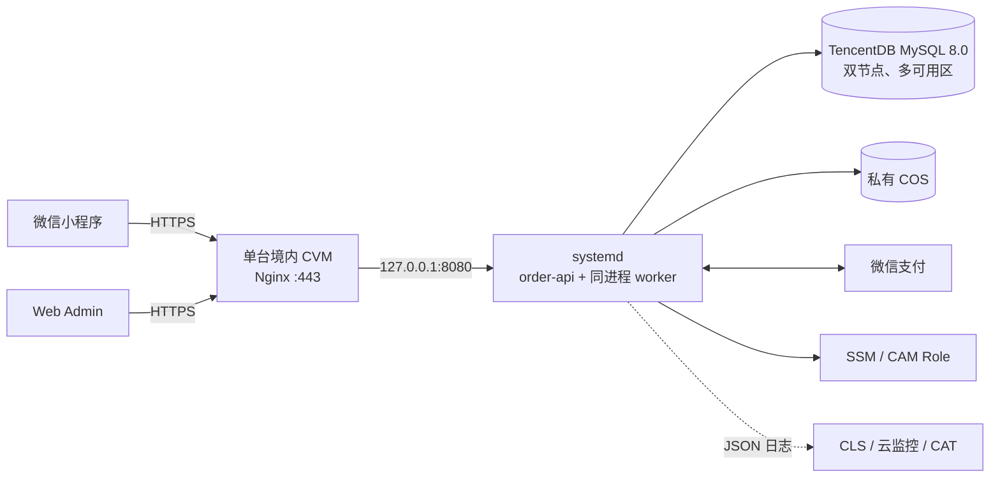

## Context

当前 `main@cb2605f477e58ac5471a0c535b85256c6be80a00` 已归档一期产品基线、Loop Engineering 控制面和 change 质量门禁；`bootstrap-api-service` 已集成 Go 1.26.5 + Gin 的单模块进程基线。现有 `order-api` 只具备配置加载、JSON `slog`、HTTP timeout、健康端点和优雅退出，不含数据库、业务 API、支付、对象存储、worker、migration 或部署。

归档产品基线已经固定一期规模和交易约束：500 人以内、100–200 人同时在线、5–10 分钟 100–300 单；库存唯一键为`营业日期 × 餐段 × 商品`，提交订单原子创建 15 分钟软预占。该产品决定是本 change 的只读输入，不是架构 Open Question，也不在本 change 实现。

当前技术文档只列出抽象 API、数据库、对象存储和定时任务；腾讯云客户指南仍把 MySQL/TDSQL-C、公有读/私有 COS、长期 SecretId/SecretKey 和 CDN 写成待选或默认路径。这会迫使后续 writer 重复选型，并形成第二事实源。本 change 因此只完成一个 W0/UI0 结果：把单一生产架构同步写入技术文档与客户指南，后续实现 change 只能依赖该基线，不得重新选择平台。

官方依据均为公开直链，规划访问日期为 2026-08-12：

| 主题 | 官方依据 |
| --- | --- |
| MySQL 双节点一主一备、自动转移 | https://cloud.tencent.com/document/product/236/47906 |
| MySQL 自动备份与 binlog 保留 | https://cloud.tencent.com/document/product/236/35172 |
| MySQL 备份 + binlog 时间点回档 | https://cloud.tencent.com/document/product/236/7276 |
| COS 私有访问、版本控制与加密 | https://cloud.tencent.com/document/product/436/50200 |
| COS 预签名上传 | https://cloud.tencent.com/document/product/436/14114 |
| SSM 密钥管理 | https://cloud.tencent.com/document/product/1140/40416 |
| CAM 角色与临时凭证 | https://cloud.tencent.com/document/product/598/19421 |
| CLS 与 LogListener | https://cloud.tencent.com/document/product/614/56479 、https://cloud.tencent.com/document/product/614/17415 |
| 云监控与 CAT | https://cloud.tencent.com/document/product/248/62458 、https://cloud.tencent.com/document/product/280 |
| Nginx HTTPS 与境内备案资源 | https://cloud.tencent.com.cn/document/product/400/35244 、https://cloud.tencent.com/document/product/243/18908 |
| 微信支付回调的验签、解密、5 秒应答与重试 | https://pay.wechatpay.cn/doc/v3/merchant/4012791861 |

## Goals / Non-Goals

**Goals:**

- 让后续数据库、订单、支付、媒体、部署、观测和恢复 changes 获得唯一组件与责任边界。
- 固定 MySQL 同步事务、inbox/outbox、同进程 worker 和外部调用的原子性边界。
- 固定 migration、环境隔离、配置/密钥、私有 COS、备份恢复、RPO/RTO 目标、观测和容量升级规则。
- 把技术文档与客户开通指南改成同一事实源的开发视图和采购/责任视图，消除现有冲突表述。
- 只保留必须由真实账号、实际采购和客户平台身份提供的外部占位符，并对敏感正文设硬阻断。

**Non-Goals:**

- 不实现或测试库存、订单、支付、退款、核销、数据库 schema、worker、migration、部署、监控或备份。
- 不修改产品 PRD、客户清单、合同、根治理、质量/loop skills、Go/JS 代码或任何公共 API。
- 不购买、配置、探测或写入真实腾讯云、微信、域名、证书、数据库、COS、CLS 或监控资源。
- 不引入 Kubernetes、微服务、CloudBase Run、Docker 运行依赖、Redis、MQ、读写分离、数据库代理、CLB、CDN、跨地域灾备或 7×24 人工值守。
- 不把未实测容量、RPO/RTO 写成已达成结果、SLA 或云厂商保证。

## Decisions

### D1. 生产只有一个 CVM 部署单元

生产流量路径固定为：

- Nginx 负责 TLS、Web Admin 静态文件和反向代理；`:80` 只跳转 HTTPS。
- `order-api` 与 worker 共享一个 Go 进程和发布版本，由 systemd 拉起、停止和重启。
- CDB 使用同地域 MySQL 8.0 双节点、多可用区、一主一备；不开放公网。
- COS、SSM/CAM、CLS/云监控/CAT 分别承担图片、密钥、日志/指标/探测，不由 CVM 本地磁盘替代。

不选 CloudBase Run，因为当前容量不需要容器弹性，且会增加运行平台、VPC、配额和备案约束；不选单机 MySQL/COS，因为交易数据、应用和图片会落在同一故障域；不选多 CVM/CLB，因为合同没有 7×24 承诺，当前容量也没有计算节点水平扩展证据。

### D2. 同步事务只负责 MySQL 内的持久事实

同步写路径固定为：

1. Handler 完成鉴权、输入校验和请求幂等键校验。
2. 开启 MySQL 事务并使用条件更新或必要行锁读取后端事实。
3. 在同一事务写业务状态、审计和必须随状态原子产生的 outbox。
4. 提交事务。
5. 仅在提交后返回持久化结果或调用微信/COS 等外部系统。

外部调用不在事务内，避免锁持有时间受网络超时控制。需要先获得微信预支付参数时，事务先创建唯一订单和支付尝试，固定 `out_trade_no` 后提交；再调用微信。响应丢失时只允许用原 `out_trade_no` 重试或查单，禁止另起支付尝试。

MySQL 是应用业务事实源；微信是支付/退款外部结算事实源。MySQL 保存不可变外部事件和当前应用投影，客户端跳转、缓存或 mock 均不是事实源。

不选分布式事务，因为当前只有一个业务数据库；不把外部调用放入事务，因为它无法让微信与 MySQL 获得原子提交，反而扩大锁与故障面。

### D3. inbox/outbox 和同进程 worker 提供持久异步闭环

逻辑记录固定为：

| 记录 | 必需字段 | 责任 |
| --- | --- | --- |
| `inbox_events` | `id`、`source`、`dedupe_key`、`event_type`、非敏感规范化 payload、`status`、`available_at`、`lease_until`、`attempts`、`last_error_code`、`created_at`、`processed_at` | 外部通知先去重持久化，再异步推进业务 |
| `outbox_events` | `id`、`aggregate_type`、`aggregate_id`、`event_type`、非敏感规范化 payload、`status`、`available_at`、`lease_until`、`attempts`、`last_error_code`、`created_at`、`processed_at` | 与业务事务原子产生，提交后执行副作用/投影 |

微信回调先验签和解密，再用稳定通知键插入 inbox；唯一冲突表示已持久化重复通知。只有 inbox 事务提交后才在总计 5 秒内返回 200/204；验证或持久化失败不返回成功。

Worker 使用 `FOR UPDATE SKIP LOCKED` 分批领取并写 lease，领取事务立即提交，随后执行外部调用，再以新事务确认。语义固定为 at-least-once，幂等消费者通过业务唯一键、条件状态转换和 provider 幂等键消除重复副作用。单次失败指数退避，上限 15 分钟；第 10 次失败进入 `DEAD` 并告警。关闭进程时不再领取新任务，遗留任务由 lease 到期重领。

未支付超时和支付对账仍由同一 worker 调度：使用数据库时间和稳定业务键生成/领取持久任务，不依赖单机内存 timer。具体订单状态、不变量与库存变更由后续 W3 业务 change 实现。

不选 MQ，因为当前峰值约每秒一笔订单，MySQL 唯一键、事务与任务表已经覆盖持久、重试和去重；加入 MQ 会引入另一套故障恢复、权限和观测面。

### D4. migration 是发布前独立命令，不是应用启动副作用

- 唯一入口是 `order-migrate`。
- 文件采用单调递增编号的 forward-only SQL，执行记录进入 `schema_migrations`。
- runner 使用 `GET_LOCK('order_schema_migrate', 30)`；30 秒拿不到锁即失败退出。
- 部署顺序是备份确认（仅破坏性 migration）→ `order-migrate` → 启动/重启 `order-api` → readiness。
- readiness 必须同时检查 DB 连接和应用支持的 schema version。
- 生产不自动 migration、不自动 down；回退使用兼容当前 schema 的旧二进制、forward fix 或已验证备份恢复。

不选“应用启动自动迁移”，因为 systemd 重启或未来多实例会让 schema 变更与进程恢复耦合；不提供自动 down，因为真实数据删除与字段缩窄无法由通用脚本安全逆转。

### D5. dev、UAT、prod 以资源和身份双重隔离

| 环境 | 固定边界 |
| --- | --- |
| dev | 本地或专属开发运行、独立开发数据库和私有测试桶、微信 stub/开发身份；不访问 UAT/prod |
| UAT | 独立 VPC、CVM、MySQL 8.0 CDB、私有 COS、域名、证书、SSM 前缀、CAM Role 和微信身份 |
| prod | 独立 VPC、单 CVM、双节点多 AZ CDB、私有 COS、域名、证书、SSM 前缀、CAM Role 和正式微信身份 |

UAT 的引擎版本必须与生产一致；CVM/CDB SKU 是采购输入，不是架构选择。生产数据不得原样进入 dev/UAT，必须不可逆匿名化；每个进程只绑定一个环境。

不选“UAT/生产同实例分库”，因为误配连接、权限或回调即可跨环境污染交易事实，节省的固定成本不足以抵消事故风险。

### D6. 非敏感配置、密钥与图片访问各走一条路径

非敏感配置只放 root-owned 且权限不宽于 `0640` 的 systemd EnvironmentFile。密钥只放 `/order/{env}/...` SSM 前缀，由当前环境 CVM CAM Role 读取；应用启动拿不到必要密钥即失败，不回退到长期访问 key。轮换通过更新 SSM 后重启进程加载。

COS 桶固定私有并禁止匿名读取/列举：

1. Admin 向 API 申请有效期不超过 15 分钟的预签名 PUT。
2. 服务端生成 object key，并约束 MIME、大小和摘要。
3. Admin 直传后调用 API 确认；MySQL 保存 object key 和元数据。
4. 客户端读取时获得有效期不超过 15 分钟的预签名 GET。
5. 开启版本控制，非当前版本 30 天后删除。

不选公有读，因为商品图 URL 会成为长期公开能力；不交付 SecretId/SecretKey，因为 CAM Role 临时身份已提供更小暴露面；不加 CDN，因为现有图片规模和流量没有命中依据。

### D7. 数据恢复优先，计算节点可重建

固定策略：CDB 每日全量备份，数据备份和 binlog 保留 14 天，销毁备份保留 7 天；破坏性 migration 前手动备份；COS 非当前版本保留 30 天；每季度恢复/克隆到隔离实例并核对 schema、订单、支付、退款、核销和操作日志。CVM 本地不保存业务事实，由发布物、Nginx/systemd 配置和 SSM 重建。

以下只作为未实测验收目标：

| 故障 | 目标 |
| --- | --- |
| Go 进程或 CDB 主备故障 | RTO ≤5 分钟 |
| CVM 丢失 | RTO ≤60 分钟 |
| 逻辑误删/损坏 | RPO ≤5 分钟，RTO ≤2 小时 |
| 区域级灾难 | 本阶段不承诺 RPO/RTO |

不使用 CVM 快照作为交易备份，因为它不能替代 CDB 全量备份与 binlog 的一致时间点恢复。没有实际演练记录时，文档不得把目标升级成已达成或整体 SLA。

### D8. 日志与告警使用低基数、脱敏字段和固定阈值

Go JSON 日志写 stderr，经 LogListener 进入 CLS 并保留 30 天。请求字段固定为 `env/request_id/method/模板化 path/status/duration_ms`；内部关联 ID 可进日志但不得成为指标 label。query/body、身份、个人信息、回调原文、外部完整交易号和全部凭据禁止进入日志、证据和告警。

阈值固定为：

| 信号 | 告警条件 |
| --- | --- |
| 公网探测 | CAT 每分钟一次，连续 3 次失败 |
| HTTP | 五分钟 5xx >1%；读取 p95 >500ms 或写入 p95 >800ms 持续 5 分钟 |
| 异步 | 最老 inbox/outbox >60 秒；任一 `DEAD` 立即告警 |
| 支付/备份 | 任一对账不一致或备份失败立即告警 |
| CVM | CPU >70% 持续 15 分钟；内存 >80%；磁盘 >75% |
| CDB | CPU 或连接使用率 >70% 持续 15 分钟；存储 >75% |
| 证书 | 剩余有效期 <30 天 |

告警全天发送，但责任边界仍是不承诺 7×24 人工值守。

### D9. 先通过目标容量门，再按证据升级

候选生产规格必须在隔离环境通过：200 并发、300 单/5 分钟、至少 1000 日订单与 300 商品；同时注入重复提交、重复/乱序回调、worker 重启和超时并发。目标为 5xx <0.1%、读取 p95 ≤500ms、写入 p95 ≤800ms，且订单、支付、核销、inbox/outbox 和归档库存不变量无重复或丢失。真实账号、SKU 与压测环境未就绪前只能写“目标/未实测”。

升级顺序不可跳过：

1. 定位慢 SQL、索引、连接池和非必要查询并重跑同一 Gate。
2. 纵向升级 CVM/CDB 并重跑同一 Gate。
3. 仍失败或计算节点 RTO 被正式要求小于 5 分钟，才允许独立 CLB/多 CVM change。
4. 索引和纵向升级后读负载仍是主要瓶颈，才允许 Redis/只读实例 change。
5. 数据库健康、增加 worker 并发、排除 provider 限流后，最老任务仍连续 15 分钟超过 60 秒，才允许 MQ change。

该顺序让容量证据而非“未来可能”决定复杂度。

### D10. 三份文档共同构成一个不可分割的基线结果

- OpenSpec design/spec 是规范源。
- `online-ordering-system-technical.md` 是开发者可执行架构视图，落组件、数据流、事务/worker、迁移、隔离、恢复、观测和容量。
- `腾讯云操作指南.md` 是客户采购和责任视图，只说明固定采购类别、责任方、外部占位符和开发方配置项，不复制业务实现细节。

两份实际文档必须在同一 change 修改和回滚，否则当前指南的二选一、公有读和长期 key 会继续污染事实源。外部占位符严格采用 spec 白名单；不允许“待定”“二选一”“按需选择”“视情况”等实现选择。敏感正文禁止入文档。

公开官方链接是 W0 link Gate 的必要外部资产：owner 为 `Production Architecture Writer`，规划时可公开访问；candidate 时必须重新访问并记录日期。网络不可用或官方页面不可访问时记 `BLOCKED_EXTERNAL`，不得用静态 URL 字符串冒充链接 PASS。真实云账号、域名和微信身份不是本 change 的必要资产。

### D11. W0/UI0 Gate 与并行所有权不可降级

- `gate_type=W0`，因为 apply 只改文档事实源；`ui_level_target=UI0` 且 UI1–UI3 不适用。
- Red 必须在未修改实际文档时由同一内容检查暴露缺少唯一拓扑、事务/worker、迁移、隔离、恢复、阈值和禁用旧口径。
- Green 只修改两个实际文档使同一检查通过；Refactor 重跑术语、歧义、外部占位符、链接、敏感、owned-path、strict 与当前仓库 Gate。
- Go、前端和治理路径是只读共享契约；并行 worker 可继续修改互斥路径，但任何目标文档或 change artifact 的并行 writer 必须先协调所有权。
- 任何 proposal/design/spec/tasks、实际文档、验收命令、base、依赖、rebase、merge 或 candidate SHA 变化都使旧验证失效。

规划的 candidate 评分目标为 `C=9、T=9、V=8、R=9`：writer 阶段 V 上限为 8；只有 exact-SHA independent PASS 后才能提高 V 并进入 `INDEPENDENT_VERIFIED`。DRAFT 本身不获得 candidate PASS。

## Risks / Trade-offs

- [单 CVM 是计算节点单点] → systemd 自动重启、CVM 可重建和 60 分钟目标覆盖当前合同边界；更短计算 RTO 触发独立 CLB change。
- [同进程 worker 与 API 争用资源] → 通过 worker 并发、任务 lease 和监控限制；只有实测 backlog 在数据库健康时仍超标才引入 MQ/独立 worker 架构。
- [MySQL 同时承担交易和任务队列] → 当前约每秒一笔订单，事务、唯一键和 `SKIP LOCKED` 足够；容量 Gate 会暴露真实争用。
- [预签名 URL 被短时转发] → 私有桶、服务端授权、15 分钟上限、随机 object key 和服务端上传约束降低暴露窗口。
- [备份存在但不可恢复] → 季度隔离恢复演练必须记录实际结果；未演练只写目标。
- [公开官方链接变化或临时不可达] → candidate 重跑链接 Gate；不可达记 `BLOCKED_EXTERNAL`，不把历史访问结果冒充当前 PASS。
- [客户指南和技术文档再次漂移] → 同一 spec 驱动两个视图，必备/禁用术语和 owned-path 检查共同 Gate。
- [外部值尚未提供] → 只使用命名白名单占位符；它们不改变架构行为，也不阻塞 W0 文档 change。

## Migration Plan

1. 本轮只提交 `DRAFT` proposal、spec、design、tasks；两个实际文档保持与 base SHA 相同。
2. 用户批准后，writer 重新读取四类 artifacts、质量协议和最新目标文档，确认 owned paths 没有并行 writer，进入 `APPROVED/IMPLEMENTING`。
3. 在修改实际文档前运行 tasks 中同一组内容、禁用口径和结构检查，记录由现有二选一、公有读、长期 key、缺少事务/恢复等目标差异产生的 Red。
4. 先重写技术文档为开发者架构视图，再重写腾讯云指南为客户采购/责任视图；不修改其他文件。
5. 重跑同一内容检查转 Green，再完成术语、歧义、占位符、链接、敏感、owned-path、strict 和当前仓库 Gate 的 Refactor/writer 验证。
6. 只提交 owned paths 形成 CANDIDATE；由另一 clean detached worktree 对 exact SHA 重跑全部声明 Gate。

回滚只整体撤销两个实际文档和本 change 的实现状态记录；没有数据库、云资源、代码或外部系统回滚。若 main 在 candidate 后推进，原 candidate 失效，writer 必须吸收新 main 后从头重跑 Gate 和独立验证。

## Open Questions

无。云账号、地域/VPC、SKU、域名证书、桶名、AppID/商户号、告警接收人和月预算均为 spec 白名单中的外部采购/身份值，不是架构行为未决项。
